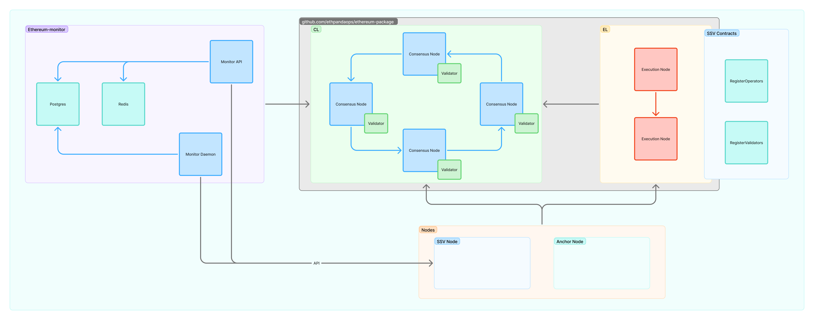

# SSV-Mini
Kurtosis devnet for running local SSV networks.

## Prerequisites
- Docker
- [Kurtosis](https://docs.kurtosis.com/install)

## Quick Start (Recommended)
The easiest way to get started is using the automated setup with the `prepare` command:

```bash
make run-with-prepare
```

This single command will:
- Clone the required repositories (ssv, anchor, ethereum2-monitor) if they don't exist
- Checkout to the correct branches (ssv: stage, anchor: unstable, ethereum2-monitor: main)
- Pull the latest changes for existing repositories
- Build the necessary Docker images
- Start the SSV network

## Manual Setup (Alternative)
If you prefer to manage the repositories and Docker images manually:

```bash
git clone https://github.com/ssvlabs/ssv.git
git checkout %YOUR_BRANCH%
docker build -t node/ssv . 
```
```bash
git clone https://github.com/sigp/anchor.git
git checkout origin/unstable
docker build -f Dockerfile.devnet -t node/anchor . 
```
```bash
git clone https://github.com/ssvlabs/ethereum2-monitor.git
docker build -t monitor . 
```


## Available Commands

### Quick Start Commands
- `make run-with-prepare` (default): Downloads/updates repos and runs the network
- `make reset-with-prepare`: Cleans everything and runs with fresh setup

### Manual Commands  
- `make run`: Runs with existing local repos and Docker images
- `make reset`: Cleans and runs with existing setup
- `make prepare`: Only prepares repositories and Docker images (without running)

### Utility Commands
- `make clean`: Stops and removes the current enclave
- `make show`: Shows currently running services
- `make restart-ssv-nodes`: Restarts SSV node services

## Interaction

### Running with Automated Setup (Recommended)

```bash
make run-with-prepare
```

### Running with Manual Setup

```bash
make run
```

View the logs of the nodes
```bash
kurtosis service logs -f localnet {service-name}
```

### Viewing currently running services

```bash
make show
```


### Restarting SSV Nodes

```bash
make restart-ssv-nodes
```

**NOTE:** When making changes to SSV Nodes locally, you need to build a new Docker image: `docker build -t node/ssv .`. Then run the following command to redeploy the nodes to the local network: `make restart-ssv-nodes`

```sh
docker build -t node/ssv .
make restart-ssv-nodes
```

## Repository Management

The `prepare` command automatically manages the following repositories:
- **SSV**: Clones from `https://github.com/ssvlabs/ssv.git` and checks out the `stage` branch
- **Anchor**: Clones from `https://github.com/sigp/anchor.git` and checks out the `unstable` branch  
- **Ethereum2-Monitor**: Clones from `https://github.com/ssvlabs/ethereum2-monitor.git` and checks out the `main` branch

All repositories are cloned to the parent directory (`../`) relative to the ssv-mini project.

### ⚠️ Anchor Image Configuration

- The `prepare` command (used by `run-with-prepare` and `reset-with-prepare`) builds the anchor image locally as `node/anchor`
- However, `params.yaml` defaults to using the remote image `sigp/anchor:v0.3.1`
- At runtime, the configuration uses the value from `params.yaml`, so the locally built `node/anchor` image is ignored

**Workaround:** To use the locally built anchor image, you need to manually change the `anchor` value in `params.yaml` from `"sigp/anchor:{tag}"` to `"node/anchor"`.

This inconsistency will be addressed in a future update with a more comprehensive approach that allows specifying the anchor source (local vs remote) via command-line parameters.

### Starting Over

#### With Automated Setup (Recommended)
Use this to shutdown the previous network and start fresh with the latest repositories:

```bash
make reset-with-prepare
```

#### With Manual Setup
Use this if you want to shutdown previous network and start one from genesis using your existing local repositories:

```bash
make reset
```

### Goals 

- Anyone can run a SSV network on their pc
- Running any SSV commit on local testnet is easy and fast
- Local setup is similar to actual testnet
- Possible to scale by adding resources

## Architecture
