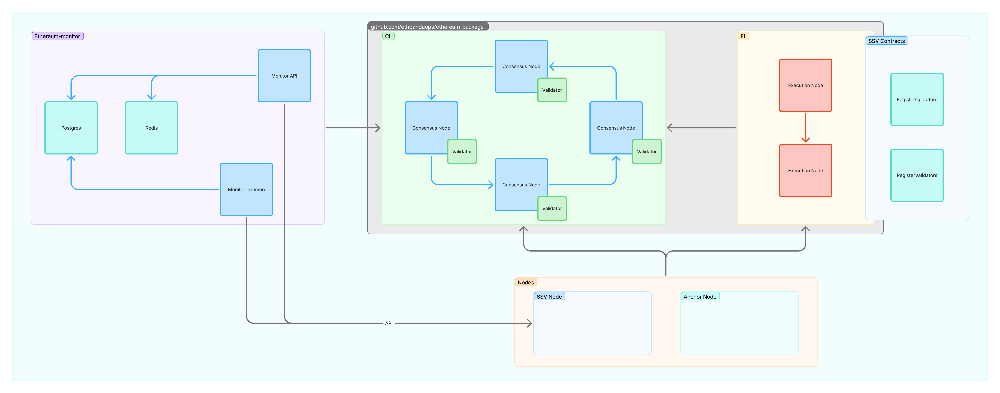

# SSV-Mini

Local SSV testnet in ~4 minutes. Kurtosis-based devnet for developing and testing SSV nodes.

## Prerequisites

- [Docker](https://docs.docker.com/get-docker/) (or [OrbStack](https://orbstack.dev/) on macOS)
- [Kurtosis CLI](https://docs.kurtosis.com/install) (`brew install kurtosis-tech/tap/kurtosis-cli`)

**Recommended:** 8+ CPU cores, 16GB+ RAM allocated to Docker.

## Quick Start

```bash
git clone https://github.com/ssvlabs/ssv-mini.git && cd ssv-mini
make prepare    # Clone SSV repo + build Docker image (~5 min first time)
make run        # Start the testnet (~4 min)
```

That's it. Run `make show` to see services and ports, `make logs` to tail SSV node logs.

### Test a specific SSV branch

```bash
SSV_COMMIT=my-feature-branch make prepare
make run
```

### Push code changes to a running testnet (~30s)

```bash
cd ../ssv && docker build -t node/ssv .
cd ../ssv-mini && make restart-ssv-nodes
```

Or use the `ssv-mini` CLI tool from the SSV repo:

```bash
# Install (one time, from ssv-mini repo):
ln -sf "$(pwd)/scripts/ssv-mini" ~/bin/ssv-mini

# Then from the SSV repo:
ssv-mini              # Create testnet or push code to running one
ssv-mini restart      # Rebuild + restart SSV nodes only
ssv-mini logs         # Tail SSV node 0 logs
```

## All Commands

```
make help
```

| Command | Description |
|---------|-------------|
| `make run` | Start testnet (default: Fulu, all forks active) |
| `make run-boole` | Start with Boole fork at epoch 3, Fulu at epoch 5 |
| `make reset` | Clean + restart from genesis |
| `make show` | Show running services and ports |
| `make logs` | Tail ssv-node-0 logs (`SERVICE=ssv-node-1` for others) |
| `make clean` | Remove all enclaves |
| `make restart-ssv-nodes` | Restart SSV nodes (after rebuilding image) |
| `make prepare` | Clone SSV repo + build Docker image |
| `make prepare-all` | Build SSV + Anchor + Monitor images |
| `make generate-keys` | Regenerate static operator keys + keyshares |

### Fault Injection

| Command | Description |
|---------|-------------|
| `make stop-el` | Stop geth (simulate EL crash) |
| `make start-el` | Restart stopped geth |
| `make swap-el EL_IMAGE=` | Hot-swap geth to custom image |
| `make restore-el` | Restore default geth |
| `make test-faulty-el` | Bloom filter cross-check test |

Use `EL_SERVICE=el-2-geth-lighthouse` to target the second EL node.

## Configuration

Edit `params.yaml` to customize the network:

```yaml
nodes:
  ssv:
    count: 4      # Valid: 4, 7, 10, 13 (3f+1 for BFT)
  anchor:
    count: 0      # Anchor consensus client nodes

network:
  network_params:
    fulu_fork_epoch: 0  # 0 = active at genesis

boole_epoch: 3          # Omit for pre-Boole

use_static_keys: true   # false = regenerate keys at runtime (~40s slower)
```

Pre-built configs:
- `params.yaml` — Fulu at genesis (default)
- `params-boole.yaml` — Electra→Boole→Fulu fork transitions

```bash
make run PARAMS_FILE=params-boole.yaml
```

## Architecture

```
┌─────────────┐     ┌─────────────┐
│  Geth (EL)  │────▶│ Lighthouse  │
│   ×2 nodes  │     │  (CL) ×2   │
└──────┬──────┘     └──────┬──────┘
       │                   │
  ┌────┴────┐        ┌────┴────┐
  │  SSV    │        │Validator│
  │ Contracts│       │ Clients │
  └────┬────┘        └─────────┘
       │
  ┌────┴──────────────────┐
  │    SSV Nodes ×4       │
  │  (operator clusters)  │
  └───────────────────────┘
```

- **Ethereum layer**: 2× Geth + 2× Lighthouse + validators (74 total)
- **SSV layer**: 4 operator nodes in a BFT cluster with 10 SSV validators
- **Contracts**: SSV Network contracts deployed via Foundry

See [CLAUDE.md](CLAUDE.md) for detailed architecture and development notes.


