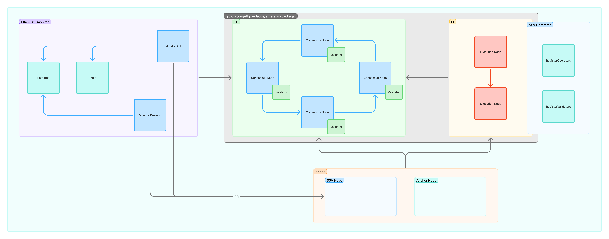

# SSV-Mini

Local SSV testnet in ~4 minutes. Kurtosis-based devnet for developing and testing SSV nodes.

## Prerequisites

- [Docker](https://docs.docker.com/get-docker/) (or [OrbStack](https://orbstack.dev/) on macOS)
- [Kurtosis CLI](https://docs.kurtosis.com/install) (`brew install kurtosis-tech/tap/kurtosis-cli`)

**Recommended:** 8+ CPU cores, 16GB+ RAM allocated to Docker.

## Quick Start

```bash
git clone https://github.com/ssvlabs/ssv-mini.git && cd ssv-mini
make prepare    # Clone SSV repo + build Docker image (~5 min first time)
make run        # Start the testnet (~4 min)
```

That's it. Run `make show` to see services and ports, `make logs` to tail SSV node logs.

### Test a specific SSV branch

```bash
SSV_COMMIT=my-feature-branch make prepare
make run
```

### Push code changes to a running testnet (~30s)

```bash
cd ../ssv && docker build -t node/ssv .
cd ../ssv-mini && make restart-ssv-nodes
```

Or use the `ssv-mini` CLI tool from the SSV repo:

```bash
# Install (one time, from ssv-mini repo):
ln -sf "$(pwd)/scripts/ssv-mini" ~/bin/ssv-mini

# Then from the SSV repo:
ssv-mini              # Create testnet or push code to running one
ssv-mini restart      # Rebuild + restart SSV nodes only
ssv-mini logs         # Tail SSV node 0 logs
```

## Gloas (ePBS) testnet

Run an all-Anchor cluster on a Gloas / EIP-7732 (ePBS) chain, for testing Anchor's `epbs` branch
through block proposal and the new 3s attestation deadline. Uses nethermind + lighthouse
`glamsterdam-devnet-5` images (geth has no Glamsterdam build).

```bash
ANCHOR_COMMIT=epbs make prepare-anchor   # build node/anchor from the epbs branch (Rust build, slow)
make run-gloas                           # or: make run-gloas-builders
make logs SERVICE=anchor-node-0          # tail an operator (no ssv-node-0 in these profiles)
```

> **Until [sigp/anchor#1090](https://github.com/sigp/anchor/pull/1090) merges into `epbs`,** build from
> the PR branch instead: `ANCHOR_COMMIT=rip-cstar make prepare-anchor`. These profiles assume the #1090
> fork model (ePBS gated on the Ethereum Gloas fork; the SSV `Fork::CStar` is gone). Once #1090 lands in
> `epbs`, plain `ANCHOR_COMMIT=epbs` is correct again.

Two profiles:
- **`params-gloas.yaml`** (`make run-gloas`): Gloas at genesis, 4-operator all-Anchor cluster,
  keyshare validators registered on-chain. The core profile for proposal and attestation-timing tests.
- **`params-gloas-builders.yaml`** (`make run-gloas-builders`): adds 2 genesis ePBS builders plus
  buildoor, exercising external bids, payload reveals, and chain-level PTC (`payload_attestations`).

### Notes and edge cases

- **Use a recent Kurtosis CLI.** 1.15.x fails on a `GpuConfig` builtin in the pinned
  `ethereum-package`; 1.19.x works (`brew upgrade kurtosis-tech/tap/kurtosis-cli && kurtosis engine restart`).
- **The profiles import a forked `ethereum-package` pin** (`shane-moore/ethereum-package`, by commit).
  Kurtosis fetches it automatically, no action needed. The fork exists because Gloas genesis needs
  `ethereum-genesis-generator >= 6.0.0` (no tagged release ships it), plus a one-line fix so genesis
  ePBS builders do not collide with the preregistered keyshare validators (indices 64-73).
- **Gloas is driven by `gloas_fork_epoch`; SSV attestations need the #1061 fix in your anchor image.**
  [sigp/anchor#1090](https://github.com/sigp/anchor/pull/1090) removed the SSV-side `Fork::CStar`, so
  ePBS now activates purely from the Ethereum fork (no `cstar_epoch` knob). Block proposals, external
  builder bids, and chain-level PTC work whenever Gloas is active. SSV cluster attestations also need
  an anchor image carrying [sigp/anchor#1061](https://github.com/sigp/anchor/issues/1061): with Gloas
  active the committee runs `GloasBeaconVote` for attestations, but the sync-committee path still runs
  `BeaconVote`, so the two no longer share one committee QBFT instance. The attestation consensus still
  reaches COMMIT, but the sync consensus round-changes every slot and never completes, and because the
  committee's post-consensus partial-signature batch is sized to attestations + sync messages, it never
  fills, so the agreed attestation is never submitted. Measured live on a plain #1090 image (`rip-cstar`):
  proposals canonical, attestations 0. Consensus succeeds; only submission is blocked.
- **`make prepare-anchor` moves `../anchor`'s checkout** to a detached HEAD at `origin/epbs`. If you
  keep local work in `../anchor`, branch or stash it first (commits are not lost, but HEAD relocates).
- **All-Anchor cluster** (`ssv.count: 0`): no `node/ssv` image is needed, so skip `make prepare`.
  Monitor is disabled in these profiles and the cluster does not need it; leave it off.
- **Builders live in the Gloas `BeaconState.builders` registry**, not the validator set. Query there,
  not `/eth/v1/beacon/states/head/validators`.
- **Cluster slots are execution-empty by design (for now).** Anchor proposers self-build and never
  reveal the payload (SIP-94 envelope stub), so cluster-proposed slots advance the CL but not the EL,
  and PTC votes `payload_present=false` on them. Expected, not a failure: the gating work is Anchor's
  bid-targeting path, not envelope signing.

## All Commands

```
make help
```

| Command | Description |
|---------|-------------|
| `make run` | Start testnet (default: Fulu, all forks active) |
| `make run-boole` | Start with Boole fork at epoch 3, Fulu at epoch 5 |
| `make run-gloas` | Start with Gloas (ePBS) at genesis, all-Anchor cluster |
| `make run-gloas-builders` | Start with Gloas at genesis + buildoor ePBS builders |
| `make reset` | Clean + restart from genesis |
| `make show` | Show running services and ports |
| `make logs` | Tail ssv-node-0 logs (`SERVICE=ssv-node-1` for others) |
| `make clean` | Remove all enclaves |
| `make restart-ssv-nodes` | Restart SSV nodes (after rebuilding image) |
| `make prepare` | Clone SSV repo + build Docker image |
| `make prepare-all` | Build SSV + Anchor + Monitor images |
| `make generate-keys` | Regenerate static operator keys + keyshares |

### Fault Injection

| Command | Description |
|---------|-------------|
| `make stop-el` | Stop geth (simulate EL crash) |
| `make start-el` | Restart stopped geth |
| `make swap-el EL_IMAGE=` | Hot-swap geth to custom image |
| `make restore-el` | Restore default geth |
| `make test-faulty-el` | Bloom filter cross-check test |

Use `EL_SERVICE=el-2-geth-lighthouse` to target the second EL node.

## Configuration

Edit `params.yaml` to customize the network:

```yaml
nodes:
  ssv:
    count: 4      # Valid: 4, 7, 10, 13 (3f+1 for BFT)
  anchor:
    count: 0      # Anchor consensus client nodes

network:
  network_params:
    fulu_fork_epoch: 0  # 0 = active at genesis

boole_epoch: 3          # Omit for pre-Boole

use_static_keys: true   # false = regenerate keys at runtime (~40s slower)

register_validators: true  # Register keyshare validators on-chain (default false; the
                           # aetheria executor registers its own). Required for standalone
                           # runs where SSV/Anchor nodes should actually perform duties.
```

Pre-built configs:
- `params.yaml` — Fulu at genesis (default)
- `params-boole.yaml` — Electra→Boole→Fulu fork transitions
- `params-gloas.yaml` — Gloas (ePBS) at genesis, all-Anchor cluster (needs `ANCHOR_COMMIT=epbs make prepare-anchor`)
- `params-gloas-builders.yaml` — Gloas at genesis + buildoor ePBS builders (experimental)

```bash
make run PARAMS_FILE=params-boole.yaml
```

## Architecture

```
┌─────────────┐     ┌─────────────┐
│  Geth (EL)  │────▶│ Lighthouse  │
│   ×2 nodes  │     │  (CL) ×2   │
└──────┬──────┘     └──────┬──────┘
       │                   │
  ┌────┴────┐        ┌────┴────┐
  │  SSV    │        │Validator│
  │ Contracts│       │ Clients │
  └────┬────┘        └─────────┘
       │
  ┌────┴──────────────────┐
  │    SSV Nodes ×4       │
  │  (operator clusters)  │
  └───────────────────────┘
```

- **Ethereum layer**: 2× Geth + 2× Lighthouse + validators (74 total)
- **SSV layer**: 4 operator nodes in a BFT cluster with 10 SSV validators
- **Contracts**: SSV Network contracts deployed via Hardhat (ssv-network v2.0.0)

See [CLAUDE.md](CLAUDE.md) for detailed architecture and development notes.


