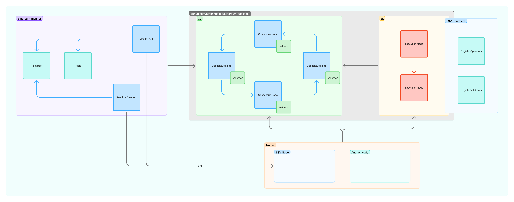

# SSV-Mini

Local SSV testnet in ~4 minutes. Kurtosis-based devnet for developing and testing SSV nodes.

## Prerequisites

- [Docker](https://docs.docker.com/get-docker/) (or [OrbStack](https://orbstack.dev/) on macOS)
- [Kurtosis CLI](https://docs.kurtosis.com/install) (`brew install kurtosis-tech/tap/kurtosis-cli`)

**Recommended:** 8+ CPU cores, 16GB+ RAM allocated to Docker.

## Quick Start

```bash
git clone https://github.com/ssvlabs/ssv-mini.git && cd ssv-mini
make prepare    # Clone SSV repo + build Docker image (~5 min first time)
make run        # Start the testnet (~4 min)
```

That's it. Run `make show` to see services and ports, `make logs` to tail SSV node logs.

### Test a specific SSV branch

```bash
SSV_COMMIT=my-feature-branch make prepare
make run
```

### Push code changes to a running testnet (~30s)

```bash
cd ../ssv && docker build -t node/ssv .
cd ../ssv-mini && make restart-ssv-nodes
```

Or use the `ssv-mini` CLI tool from the SSV repo:

```bash
# Install (one time, from ssv-mini repo):
ln -sf "$(pwd)/scripts/ssv-mini" ~/bin/ssv-mini

# Then from the SSV repo:
ssv-mini              # Create testnet or push code to running one
ssv-mini restart      # Rebuild + restart SSV nodes only
ssv-mini logs         # Tail SSV node 0 logs
```

## All Commands

```
make help
```

| Command | Description |
|---------|-------------|
| `make run` | Start testnet (default: Fulu at genesis) |
| `make run-boole` | Start with Boole fork at epoch 3 |
| `make run-gloas` | Start with Gloas/ePBS (EIP-7732) fork at epoch 2 (devnet-6 images) |
| `make reset` | Clean + restart from genesis |
| `make show` | Show running services and ports |
| `make logs` | Tail ssv-node-0 logs (`SERVICE=ssv-node-1` for others) |
| `make clean` | Remove all enclaves |
| `make restart-ssv-nodes` | Restart SSV nodes (after rebuilding image) |
| `make prepare` | Clone SSV repo + build Docker image |
| `make prepare-anchor` | Clone Anchor repo + build Docker image; useful when using custom branch |
| `make prepare-monitor` | Clone E2M repo + build Docker image |
| `make prepare-all` | Build SSV + Anchor + Monitor images |
| `make generate-keys` | Regenerate static operator keys + keyshares |

### Fault Injection

| Command | Description |
|---------|-------------|
| `make stop-el` | Stop geth (simulate EL crash) |
| `make start-el` | Restart stopped geth |
| `make swap-el EL_IMAGE=` | Hot-swap geth to custom image |
| `make restore-el` | Restore default geth |
| `make test-faulty-el` | Bloom filter cross-check test |

Use `EL_SERVICE=el-2-geth-lighthouse` to target the second EL node.

### Switching an M3 fault

**Prerequisite:** the enclave's SSV image must be the instrumented build — `node/ssv-fault`, built
from the ssv branch `qa/gloas-m3-fault-menu` (a distinct tag so `FAULT=none` operators can keep
running the plain `node/ssv` image; see `qa/FAULTS.md` §10) — and `$SSV_REPO` (default `../ssv`)
must be checked out on that same branch, because `make fault-list`/`make fault` enumerate the menu
by running `go run ./qa/faults/cmd/list` in it. On a stock node `FAULT` is simply ignored, so a
missed prerequisite does not error clearly — it shows up as the boot-banner timeout below.

```bash
make fault-list                          # the 19 values
make fault FAULT=vote-index-2 OP=5       # archive, switch, verify
make fault-off OP=5
```

`make fault` rejects a value that is not in the menu **before** it touches the enclave, and fails
fast if `OP`'s container cannot be resolved — in both cases nothing is archived and nothing is
switched. Container resolution is by Kurtosis label (`kurtosis_service_name` /
`kurtosis_enclave_uuid`), not by container name, so a co-tenant enclave running the same operator
index cannot be picked by accident; a match count other than 1 is always an error. Otherwise it
archives the operator's buffered logs to `.fault-logs/` first, because the switch destroys them,
and aborts if the archive holds no JSON log lines — pass `ALLOW_EMPTY_ARCHIVE=1` only when the
operator genuinely has no logs worth keeping (`fault-off` warns instead of aborting on this, since
it runs at the end of a fault window and aborting would strand the operator faulted). The switch
command's own exit status is checked — a failed `kurtosis service update` stops the recipe there,
it does not fall through to verification against the still-running old container. It then fails
non-zero unless the **newly-created** container comes back within `FAULT_BANNER_TIMEOUT` (default
180 s) with a boot banner naming the requested fault (the poll re-resolves the container by label
each iteration and skips while its ID still matches the pre-switch container, so a retried or
same-value switch cannot be verified against the old container's buffer); on that timeout, do not
record a verdict for this operator's window until its state is confirmed by hand — the most likely
cause is that the enclave is not running the instrumented image (see the prerequisite above; on a
stock node this timeout is exactly what you see). `make fault-off OP=5` runs the same
archive-then-verify sequence with `FAULT=none`.

Operator 4's gas limit for PRF-04 and PRF-11 needs the same env-var mechanism, set by hand:
`ExperimentalGasLimit` / env `EXPERIMENTAL_GAS_LIMIT` (`operator/validator/controller.go:99` in
`ssv`). `ssv-mini` has no params key for it — either add the env var to a local copy of
`nodes/ssv/node.star`'s `env_vars` before `make run`, or set it after bring-up with `kurtosis
service update --env`. **`--env` replaces the whole variable list, not just the named key** —
before using the second route, read the operator's current env first (`kurtosis service inspect`)
and re-declare every existing pair alongside the new one, or the update silently drops `FAULT` and
everything else. See `scenarios/gloas/PRF-04.md`'s "Preconditions and setup" for both routes in
full and `scenarios/gloas/PRF-11.md` for why the value matters.

A fault switch is a `kurtosis service update`, which re-creates the container: the node's buffered
logs are lost and it resyncs before it takes part in duties again. Measured on a 4-node Gloas
enclave on 2026-09-08: **7 s** from the update to the boot banner, **1 slot** until the
operator injected its first fault. `make fault` archives the logs before switching for exactly this
reason. A `kurtosis service stop` + `start` **does** preserve the container filesystem.

### Reading ssv-node logs on `--env mini`

`scout.py --env mini logs query` returns nothing for `ssv-node` on this rig, and no query change
fixes it — **`docker logs <container>` is the only working read path.** Three causes were found:

- Unconditional OTLP trace export to a collector no profile here creates — **fixed**, gated behind
  `nodes.ssv.enable_traces` (default off, see `params.yaml`). Note: `enable_traces` does not
  survive a fault switch — `make fault`'s `--env FAULT=...` replaces the operator's whole env-var
  list, dropping the OTEL pair too. The node still boots because commit `86f8750` moved
  `--config=` into the entrypoint instead of depending on that `--env` list; reverting that change
  would silently break every switch.
- The container printing plain-text lines from the node's own Makefile target before its JSON
  logging started — **fixed**, by exec'ing the `ssvnode` binary directly instead of going through
  `make`.
- Kurtosis's own log-collection engine cannot read the resulting per-line JSON — **still open**.
  It is well-evidenced (the enclave-wide fluent-bit filter parses each line's JSON and merges the
  parsed fields into a shape the log engine does not expect) but it lives inside Kurtosis itself,
  not in `ssv-mini` or `ssv`, so it is not fixed here.

Every M3 scenario-card oracle is written as a `scout.py --env mini logs query` call. Until scout
gains a `docker logs` fallback for `--env mini`, translate each one by hand, e.g.:

```bash
docker logs $(docker ps --filter label=kurtosis_service_name=ssv-node-5 --format '{{.Names}}') | grep '"qa_fault"'
```

## Configuration

Edit `params.yaml` to customize the network:

```yaml
nodes:
  ssv:
    count: 4      # Valid: 4, 7, 10, 13 (3f+1 for BFT)
  anchor:
    count: 0      # Anchor consensus client nodes

images:
  ssv: "node/ssv"
  anchor: "sigp/anchor:v1.2.0"  # needs to be changed to node/anchor when using local built anchor image

network:
  network_params:
    fulu_fork_epoch: 0  # 0 = active at genesis (default); set large (e.g. 100000) to defer

boole_epoch: 3          # Omit for pre-Boole

use_static_keys: true   # false = regenerate keys at runtime (~40s slower)
```

Pre-built configs:
- `params.yaml` — Fulu at genesis (default)
- `params-boole.yaml` — Alan→Boole fork transitions; needs `SSV_COMMIT=integration/boole-convergence make prepare`
- `params-gloas.yaml` — Fulu→Gloas (ePBS/EIP-7732) transition; needs `SSV_COMMIT=epbs-gloas make prepare` and ethpandaops glamsterdam-devnet-6 client images (digest-pinned; monitor/E2M enabled - prepare it beforehand)
- `params-gloas-multibn.yaml` — same Gloas transition, but each operator gets its own beacon/execution node pair instead of sharing one (see `operator_pairs` below); needs the same `SSV_COMMIT=epbs-gloas make prepare`

```bash
make run PARAMS_FILE=params-boole.yaml
```

### Per-operator beacon and execution nodes (`operator_pairs`)

By default every SSV and Anchor operator shares one beacon node and one execution node.
`operator_pairs` maps each operator onto its own CL/EL pair.

```yaml
operator_pairs:
  - [0]           # op0: pair 0 only
  - [1]           # op1: pair 1 only
  - [2, 0, 1, 3]  # op2: pair 2 primary, then 0, 1, 3 as failover
  - [3]           # op3: pair 3 only
```

- The index is the **global operator index**: Anchor nodes come first, then SSV nodes.
- A pair index selects one `network.participants` entry — its CL **and** its EL.
- Pair indices are **0-based**; the kurtosis service names are **1-based** (`pair 0` is
  `cl-1-...`).
- Omit the key entirely and every operator goes to pair 0, which is the historical behaviour.
- The archive exporter is not an operator and needs no entry.
- go-SSV receives the list `;`-joined (`BeaconNodeAddr`, `ETH1Addr`); Anchor receives it
  `,`-joined (`--beacon-nodes`, `--execution-rpc`) and takes only the primary for
  `--execution-ws`.

**Validator budget.** Every participant group runs its own validator client, and
`main.star` fails the run if `validator_count × count` summed across all groups exceeds 64
— indices 64-73 belong to the aetheria seed, and an overlap would make the VCs and the SSV
operators sign with the same keys. With four pairs use `validator_count: 16` each.

Run the validation suite for this map with `make test-topology`.

### Fork blind spot (`blindspot_pairs`)

`blindspot_pairs` starts a spec-rewriting proxy in front of an existing pair's beacon node
and appends the proxy as a NEW pair index, right after the real participants (pair 0 always
stays a real pair — `infra`, the contract deploy, the block-height gates, the keysplit,
validator registration and the monitor never see a rewritten spec).

```yaml
blindspot_pairs:
  - upstream: 3               # pair 3's CL is proxied; its EL is untouched
    strip: [GLOAS_FORK_EPOCH]
operator_pairs: [[0], [1], [2], [4]]  # op3 now points at pair 4, the proxy
```

- The proxy **deletes** the listed spec key; it never rewrites it to a far-future value. A
  far-future value makes the node log the INFO "fork scheduled" line instead, which is the
  wrong oracle for TRN-04 (the alert watches for the *missing* Info line).
- Limits: the proxy only sits on the CL path (the EL is the upstream pair's, untouched), and
  it adds a network hop — never route timing or fault-injection scenarios through it.
- Requires `make prepare-blindspot-proxy` before bring-up. See the commented example in
  `params-gloas-multibn.yaml` for the full block plus the TRN-05 passthrough call.

## Architecture

```
┌─────────────┐     ┌─────────────┐
│  Geth (EL)  │────▶│ Lighthouse  │
│   ×2 nodes  │     │  (CL) ×2   │
└──────┬──────┘     └──────┬──────┘
       │                   │
  ┌────┴────┐        ┌────┴────┐
  │  SSV    │        │Validator│
  │ Contracts│       │ Clients │
  └────┬────┘        └─────────┘
       │
  ┌────┴──────────────────┐
  │    SSV Nodes ×4       │
  │  (operator clusters)  │
  └───────────────────────┘
```

- **Ethereum layer**: 2× Geth + 2× Lighthouse + validators (74 total)
- **SSV layer**: 4 operator nodes in a BFT cluster with 10 SSV validators
- **Contracts**: SSV Network contracts deployed via Hardhat (ssv-network v2.0.0)

See [CLAUDE.md](CLAUDE.md) for detailed architecture and development notes.


